# Diploma in Web Development – Milestone Project 4

## UMAMI BOX
### Project Overview
UMAMI BOX is an Asian-cuisine-inspired meal kit that helps individuals and family members reduce cooking time and save time together. The website is a full-stack e-commerce platform that allows users to browse meal kits, ready meals, and signature sauces inspired by Chinese, Japanese, and Korean cuisines. The purpose is to make home cooking easier by providing fresh ingredients, pre-made sauces, simple cooking instructions, and, more importantly, to reduce carbon emissions by cutting food waste. 

The project also promotes sustainability through reusable packaging and a return recycling reward business strategy. Users can create an account, save favourite meals, add meals to the basket, complete checkout and view previous order history.

---

### 1.00 Project formatting
HelloFresh and Gusto inspire UMAMI BOX; the project is an e-commerce platform focused on Asian-cuisine meal kits, ready meals, and signature sauces. The website combines functions of website/product instructions, product browsing, basket, checkout (with Stripe), and account and admin management.  

#### 1.01 Strategy Plane_User Goals
The aim of the user's goal is to make the interface easier to understand visually for all ages, allowing users to view and select different products and services to make cooking easier and more accessible. 

Site users want to: 
 - Understand what UMAMI BOX offers
 - Browse Asian-inspired meal kits, ready meals and signature sauces
 - Filter products by category, cuisine and dietary preferences
 - Search for specific products
 - View particular product details
 - Add products to basket
 - Adjust product quantity
 - Complete payment safely using Stripe
 - Receive order confirmation by email
 - Create user accounts
 - Save favourite meals for later

#### 1.02 Strategy Plane_Client Goals
The client's goal is to create a professional e-commerce platform that promotes and sells asian cuisine.

The client wants the site to: 
- Present the UMAMI BOX brand to a wider range of audience
- Make food offering ordering process easier to understand
- Build trust through clean design and secure checkout using Stripe
- Allow customers to create accounts
- Send confirmation emails
- Allow admin to manage products


#### 1.03 Strategy Plane_Developer and Business Goals
##### Developers aim:
- Build a full-stack Django project
- Use reusable templates and views
- Create a product catalogue
- Add a JavaScript function to improve the user interface
- Integrate Stripe payments
- Handle Stripe webhooks
- Use Amazon S3 for external static and media storage
- Deploy the project to Heroku
- Adjust and update code standards using Flake 8.
- Keep sensitive data separate.

##### Site users aim:
- Find products quickly
- Understand product details
- Add items to the basket
- Check out without confusion
- Add delivery date and time
- Receive order confirmation
- Create a user account to store saved meals and previous order history
- Delete Account when no longer in use

##### Web managers aim:
- Add new products
- Edit product information
- Mark unavailable products as invalid
- View orders in Django admin
- Manage customer and order information

#### 1.05 Skeleton Plane_Design Choices
The design was planned to be simple, clean and user-friendly with minimal colour palettes. 
The layout avoids unnecessary clutter and keeps the product action clear.

Important design choices include:
- A strong dark green navigation bar
- A warm neutral background with neutral coloured images
- Product cards with clear imagery
- Large page headings
- Consistent buttons
- Responsive Bootstrap grid layout
- Footer branding and social links

##### Main navigation structure
The main navigation includes:

- Home
- Shop
- How It Works
- Sustainability
- About
- Account/Profile icon
- Basket icon


#### 1.06 Styling
To keep the styling consistent across the website, generic CSS variables are defined inside the template with `:root`. This allows colours, buttons, spacing and other repeated styles to use the same default values throughout the app. By using `:root`, the website maintains a more consistent visual style and makes future design changes easier to manage.

```
:root {
     /* Brand colours */
    --color-primary: #123525;          /* deep green header/buttons */
    --color-primary-light: #1E4A35;    /* hover green */
    --color-primary-dark: #03110a;     /* darker green */

    --color-secondary: #D8B56D;        /* muted gold accent */
    --color-accent: #C85A3A;           /* chilli / basket badge / spice */

    /* Background colours */
    --color-background: #F8F1E6;       /* warm cream */
    --color-background-soft: #F1E5D2;  /* soft beige section */
    --color-card: #FFF9EF;             /* card background */
    --color-card-warm: #F4E8D5;        /* category / content card */
    --color-white: #FFFFFF;

    /* Text colours */
    --color-text: #1F1B16;             /* main text */
    --color-heading: #14291F;          /* heading dark green */
    --color-muted: #6F675C;            /* muted paragraph text */
    --color-light-text: #FFF9EF;       /* text on dark green */

    /* Borders */
    --color-border: #D8C8AF;
    --color-border-light: #E8DCCB;

    /* Status colours */
    --color-success: #2F6B45;
    --color-warning: #D9A441;
    --color-error: #A63A2A;

    /* Fonts */
    --font-logo: 'Inter', sans-serif;
    --font-heading: 'Inter', serif;
    --font-body: 'Inter', sans-serif;

    /* Fonts */
    --font-logo-size:15px;
    --font-heading-size:14px;
    --font-subheading-1-size: 15px;
    --font-subheading-2-size: 12px;
    --font-subheading-3-size: 11px;
    --font-subheading-4-size: 10px;
    --font-subheading-5-size: 9px;
    --font-body-size: 10px;
    --font-annotation-size:9px;

    /* Icon sizes */
    --icon-size-1-5: 1.5em;
    --icon-size-1-7: 1.7em;
    --icon-size-1-8: 1.8em;
    --icon-size-2-0: 2em;
    --icon-size-2-5: 2.5em;
    --icon-size-3-0: 3em;

    /* Spacing */
    --spacing-size-3-0: 3em;
    --spacing-size-4-0: 4em;
    --spacing-size-5-0: 5em;
    --spacing-size-6-0: 6em;

    /* Border radius */
    --radius-sm: 0.5rem;
    --radius-md: 0.75rem;
    --radius-lg: 1.25rem;
    --radius-pill: 999px;

    /* Shadows */
    --shadow-soft: 0 8px 24px rgba(31, 27, 22, 0.08);
    --shadow-card: 0 4px 16px rgba(31, 27, 22, 0.06);

    --moible-side-padding: 1.5em;
    --tablet-side-padding: 5em;
    --desktop-side-padding: 4em;
}

/* ------------------------------
general css
-------------------------------*/

body {
    background-color: var(--color-background-soft);
    color: var(--color-text);
    font-family: var(--font-body);
}

h1,
h2,
h3,
h4,
h5 {
    font-family: var(--font-heading);
    color: var(--color-heading);
}

.fs-1,
.fs-2,
.fs-3,
.fs-4,
.fs-5,
.fs-6,
.fs-7 {
    font-family: var(--font-heading);
    color: var(--color-heading);
}


p{
    font-size: var(--font-body-size);
}
```

##### Typography
The typography is designed to be bold, clear and easy to read and understand.
The Site uses:
- Large uppercase headings for page titles.
- Clear body text for descriptions
- Bold navigation link
- Consistent button text
- Readable form labels and placeholders

See the snapshot of typography of each pages:
-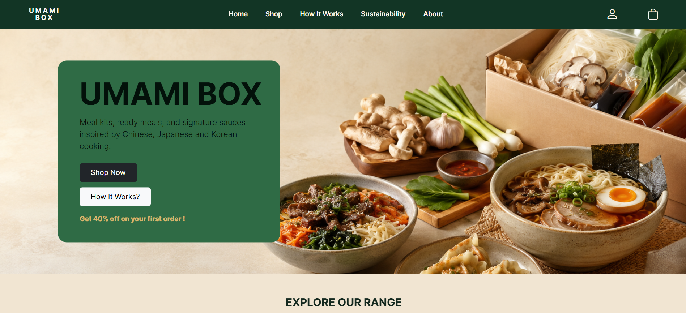
-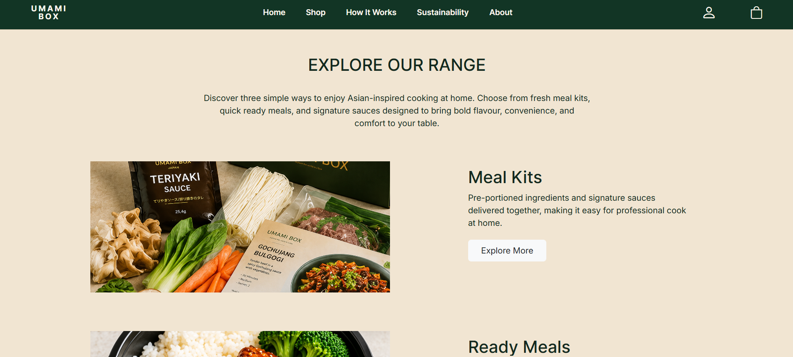
-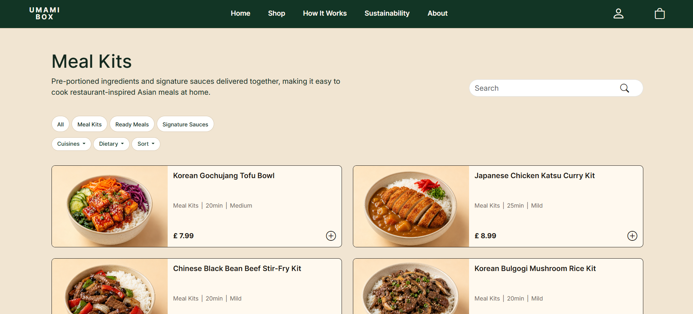
-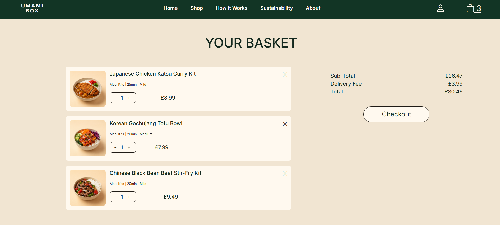
-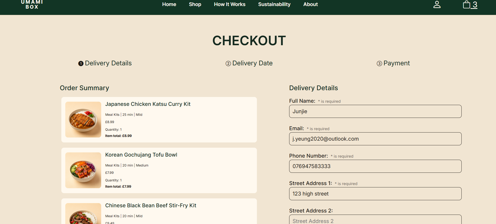
-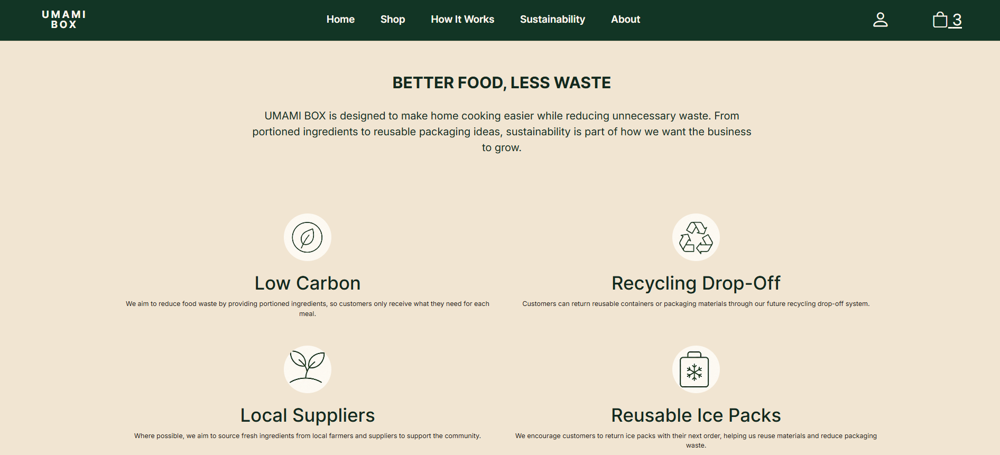
-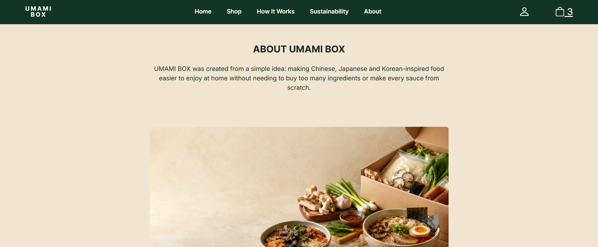
-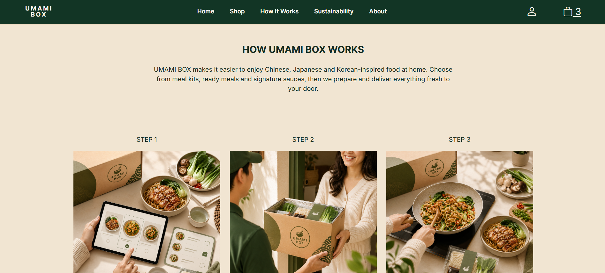
-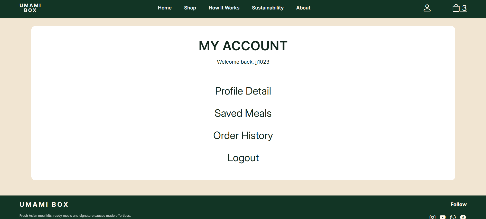

##### Colour Scheme
The main colour scheme uses:
- Dark green for the header, footer and brand identity.
- Warm cream/beige for the background.
- White for cards and content sections.
- Black/dark text for readability.
- Bootstrap alert colours for user messages.

As shown in the general code below:
```
:root {
     /* Brand colours */
    --color-primary: #123525;          /* deep green header/buttons */
    --color-primary-light: #1E4A35;    /* hover green */
    --color-primary-dark: #03110a;     /* darker green */

    --color-secondary: #D8B56D;        /* muted gold accent */
    --color-accent: #C85A3A;           /* chilli / basket badge / spice */

    /* Background colours */
    --color-background: #F8F1E6;       /* warm cream */
    --color-background-soft: #F1E5D2;  /* soft beige section */
    --color-card: #FFF9EF;             /* card background */
    --color-card-warm: #F4E8D5;        /* category / content card */
    --color-white: #FFFFFF;

    /* Text colours */
    --color-text: #1F1B16;             /* main text */
    --color-heading: #14291F;          /* heading dark green */
    --color-muted: #6F675C;            /* muted paragraph text */
    --color-light-text: #FFF9EF;       /* text on dark green */

    /* Borders */
    --color-border: #D8C8AF;
    --color-border-light: #E8DCCB;

    /* Status colours */
    --color-success: #2F6B45;
    --color-warning: #D9A441;
    --color-error: #A63A2A;
```


##### Layout Style
The layout uses Bootstrap containers, rows and columns. The design is responsive across mobile, tablet and desktop.

Click to see [UMAMI BOX wirefram view](https://miro.com/app/board/uXjVHJBA6PA=/?share_link_id=775077299756)

Layout principles:
-Central page headings.
-Product cards arranged in responsive grids.
-Basket split into items and summary.
-Forms kept in clean card layouts.


#### 1.07 Surface Plane_Wireframes
##### Mobile Wireframes
Planned mobile structure:
- Collapsed navigation menu
- Stacked content sections
- Single-column product cards
- Basket items above basket summary
- Full-width form fields
- Clear checkout button
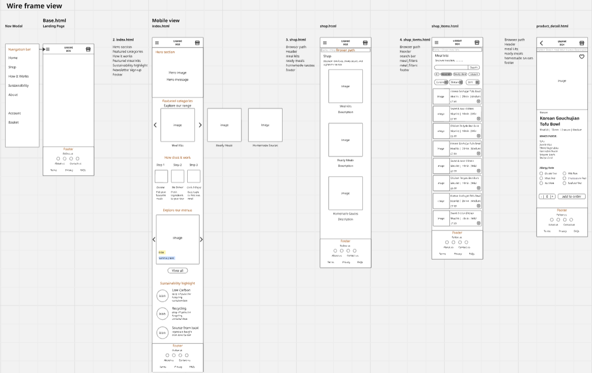
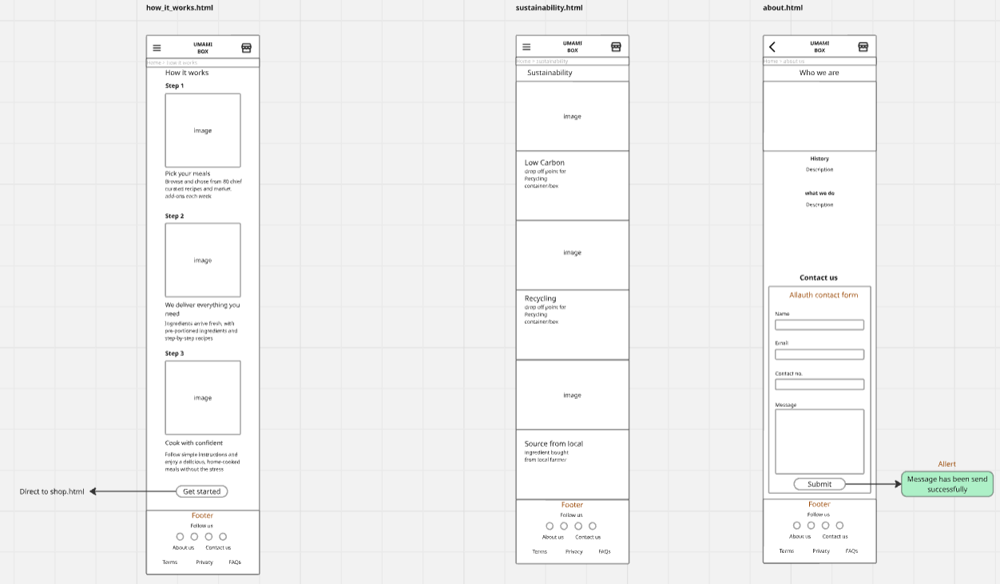
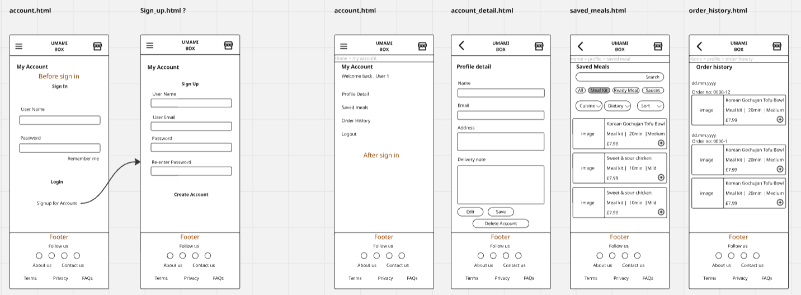
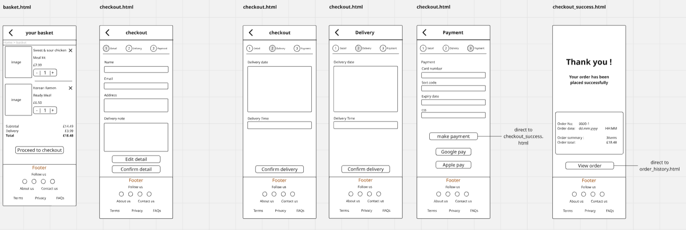
Click to see [UMAMI BOX wireframe view](https://miro.com/app/board/uXjVHJBA6PA=/?share_link_id=775077299756)

##### Tablet Wireframes
Planned tablet structure:
- Wider spacing than mobile
- Two-column product card layout where possible
- Basket summary shown below or beside items depending on screen width
- Larger buttons and improved spacing
- Padding on both sides of the webpage
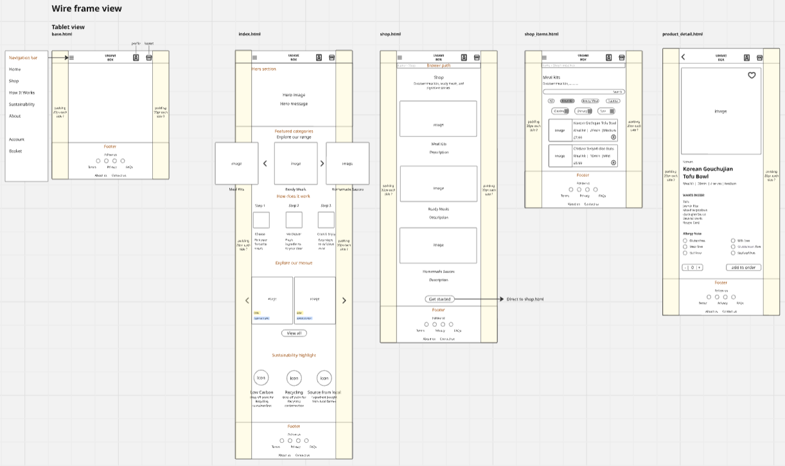
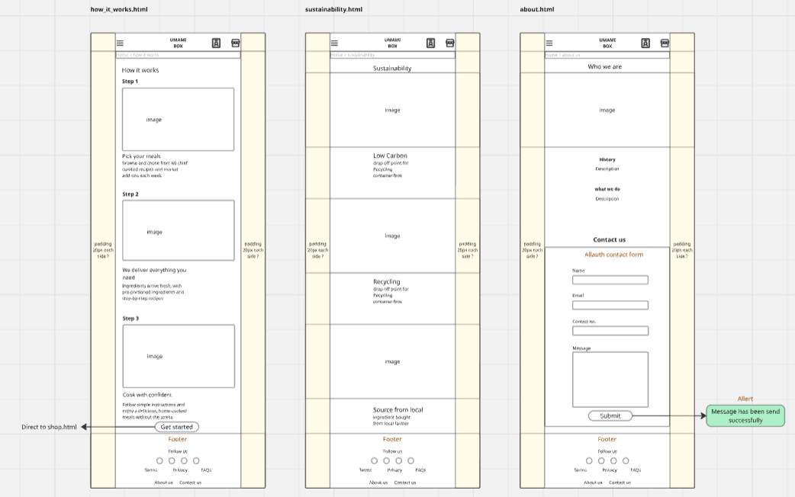
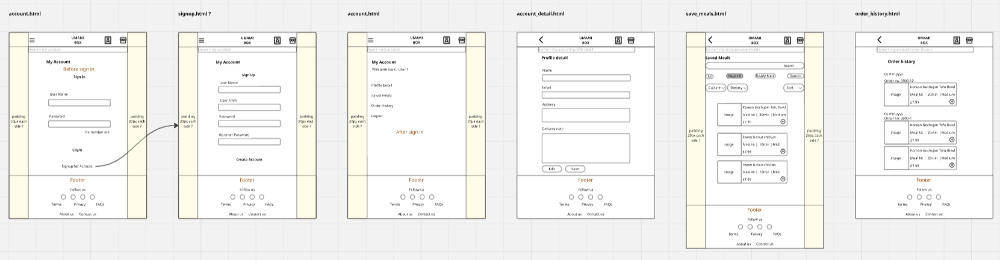
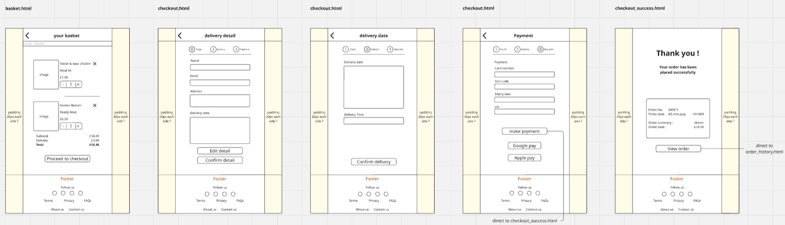
Click to see [UMAMI BOX wireframe view](https://miro.com/app/board/uXjVHJBA6PA=/?share_link_id=775077299756)
  
##### Desktop Wireframes
Planned desktop structure:
- Full navigation across the top
- Multi-column product grid
- Basket items on the left and summary on the right
- Wider content containers
- Footer across the full page width
- Padding on both sides of the webpage
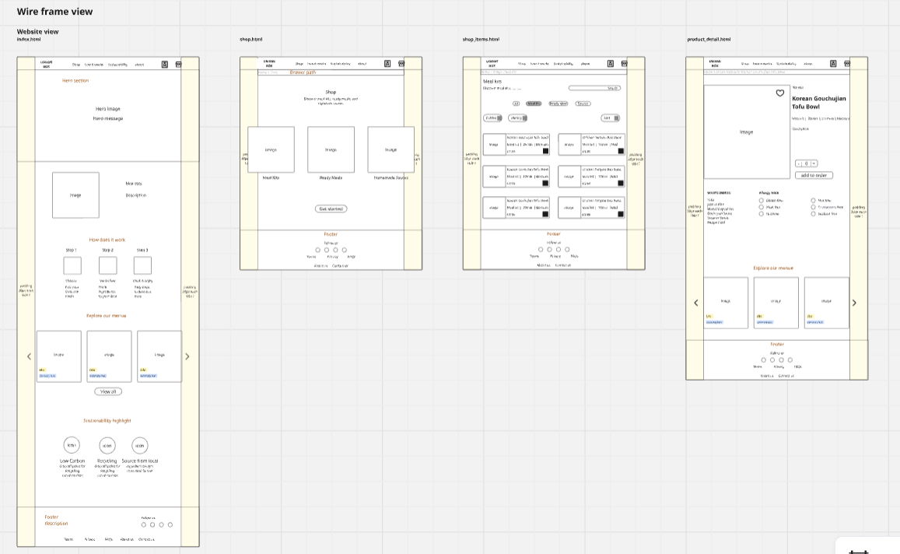
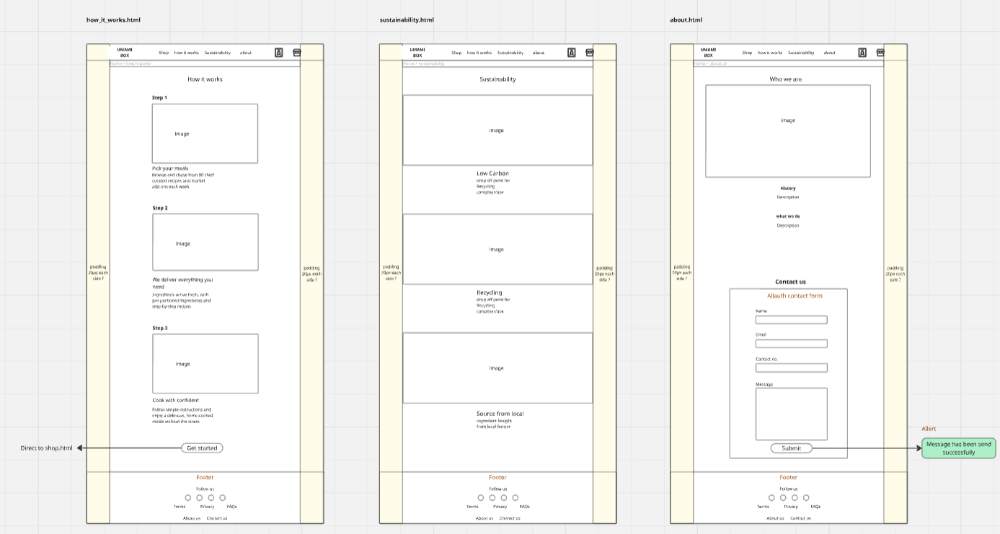
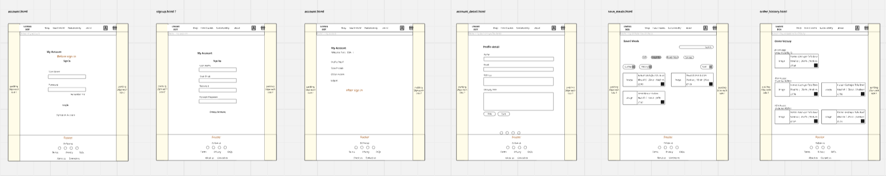
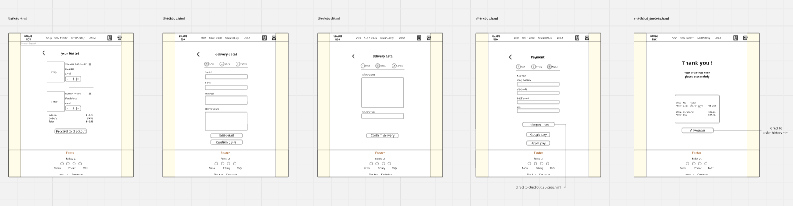
Click to see [UMAMI BOX wireframe view](https://miro.com/app/board/uXjVHJBA6PA=/?share_link_id=775077299756)

---

### 2.00 Features
Main features include:
- Responsive navigation
- Product catalogue
- Product search
- Product filtering
- Product detail pages
- Favourite/saved meals
- JavaScript basket
- Basket quantity controls
- Checkout page
- Stripe payment integration
- Stripe webhook handling
- Email verification
- Order confirmation email
- Profile page
- Admin product management
- Static information pages
- Responsive footer
  
#### 2.01 Database Schema
The project uses a PostgreSQL database in production.
[Click here to see the database and ERD diagram](https://miro.com/app/board/uXjVHIoRGtg=/?share_link_id=583598996823)


Main database models as follows:
##### Product
- Stores product information such as:
- Product name
- Description
- Price
- Image
- Category
- Cuisine
- Tags
- Spice level
- Cooking time
- Availability status

##### Category
- Stores product categories, such as:
- Meal Kits
- Ready Meals
- Signature Sauces

##### Tag
- Stores product tags used for dietary or product filtering.

##### UserProfile
- Stores customer profile and delivery details linked to a Django user.

##### SavedMeal
- Stores products saved or favourited by a user.

##### Order
- Stores customer order information including:
- User profile
- Full name
- Email
- Phone number
- Address
- Delivery notes
- Delivery date and time
- Order total
- Delivery fee
- Grand total
- Stripe payment ID
- Payment status
- Confirmation email status

##### OrderLineItem
- Stores the products and quantities linked to each order.

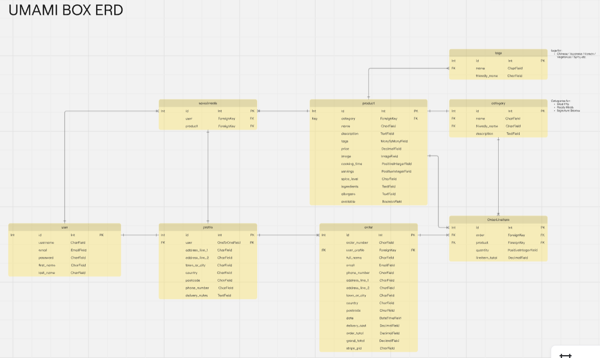

#### 2.02 HTML Features
The HTML uses Django templates and template inheritance.

Key HTML features include:
- base.html for shared page structure
- Template blocks for CSS, content and JavaScript
- Included navbar and footer templates
- Product cards
- Basket layout
- Checkout form
- Login and signup templates
- Email verification templates
- Profile form
- Static content pages

#### 2.03 Bootstrap Features
Bootstrap 5 is used throughout the project.

Bootstrap features include:
- Responsive container layout
- Row and column grid system
  Example taken from index.html indicates a responsive grid system:
  ```
  <div class="col-12 col-md-6 col-lg-3">
  ```
- Navbar layout template 
- Buttons
  Example taken from index.html:
  ```
  <div class="d-flex justify-content-center pt-4 mb-5">
            <a href="" class="btn btn-dark -==- px-4 py-2 text-uppercase">view all</a></div>
    </div>
  ```
- Form spacing
- Alerts
- Flex utilities
- Spacing utilities
- Responsive columns
- min-vh-100, d-flex, flex-column, flex-grow-1 and mt-auto for footer positioning.
- Bootstrap Icons for account, basket and social icons.
  
#### 2.04 CSS Features
Custom CSS is used alongside Bootstrap.

CSS features include:
- Brand colours 
- Custom product cards
 ```
  .product-card {
      background-color: var(--color-card);
      border: 1px solid var(--color-text);
      border-radius: var(--radius-sm);
      overflow: hidden;
      min-height: 150px;
  }
  
  .product-image-wrapper {
      width: 40%;
      flex-shrink: 0;
      border-radius: var(--radius-sm);
  }
  
  .product-image {
      width: 100%;
      height: 100%;
      object-fit: cover;
      display: block;
  }
  
  .product-card-content {
      width: 65%;
      padding: 0.8rem;
  }
  
  .product-title {
      font-family: var(--font-body);
      font-size: 1rem;
      font-weight: 600;
      color: var(--color-text);
  }
  
  .product-meta {
      display: flex;
      flex-wrap: wrap;
      gap: 0.35rem;
      font-size: 0.85rem;
      color: var(--color-muted);
  }
  
  .product-price {
      font-size: 1rem;
      font-weight: 700;
      color: var(--color-text);
  }
  
  .product-add-btn {
      padding: 0;
      border: 0;
      background: transparent;
      color: var(--color-text);
      font-size: 1.5rem;
      line-height: 1;
  }
  
  .product-add-btn:hover {
      color: var(--color-accent);
  }
  
  .order-btn {    
      background-color: var(--color-white);
      color: var(--color-primary);
      border: 1px solid var(--color-border);
      border-radius: var(--radius-pill);
      font-weight: 500;
      margin-left: 1.5em;
      margin-right: 1.5em;
  }  
  ```
- Basket styling: [basket.css](basket/static/basket/css/basket.css)
- Button styling
  ```
   /* Border radius */
    --radius-sm: 0.5rem;
    --radius-md: 0.75rem;
    --radius-lg: 1.25rem;
    --radius-pill: 999px;
  ```
- Footer styling
  ```
  .bg-umami-footer {
      background-color: var(--color-primary);
  }
  
  .footer-logo {
      font-family: var(--font-logo);
      font-size: var(--font-logo-size);
      font-weight: 700;
      letter-spacing: 0.2em;
      color: var(--color-light-text);
  }
  
  .footer-heading {
      color: var(--color-light-text);
      font-size: var(--font-subheading-2-size);
      font-weight: 700;
  }
  
  .footer-link-icon{
      color: var(--color-light-text);
      padding: 0 15px;
      font-size: var(--icon-size-1-5);
  }
  
  .footer-link {
      color: var(--color-light-text);
      font-size: var(--font-annotation-size);
      text-decoration: none;
      opacity: 0.8;
  }
  
  .footer-link:hover {
      color: var(--color-secondary);
      opacity: 1;
      text-decoration: none;
  }
  ```
- Shop page styling [Shop.css](shop/static/shop/css/shop.css)
- Responsive image presentation
- Consistent spacing and typography
  ```
  h1,
  h2,
  h3,
  h4,
  h5 {
      font-family: var(--font-heading);
      color: var(--color-heading);
  }
  
  .fs-1,
  .fs-2,
  .fs-3,
  .fs-4,
  .fs-5,
  .fs-6,
  .fs-7 {
      font-family: var(--font-heading);
      color: var(--color-heading);
  }
  
  
  p{
      font-size: var(--font-body-size);
  }
  ```
---

### 3.00 Technologies used
##### Languages
- Django (Python)
- HTML
- CSS
- Javascript

##### Frameworks and Libraries
- **Django**  
  Main Python web framework for UMAMI BOX, it handles the website structure, views, URLs, models, forms, database connections, user authentication and admin panel.

- **Bootstrap 5**
  To create a responsive layout across mobile, tablet and desktop screens.
  
- **Bootstrap Icons** 
  Visual icons such as the account icon, basket icon and social media icons in the footer.
  
- **Django Allauth**
  Manage user account functionality, including signup, login, logout and email verification.
  
- **Django Crispy Forms**
  To improve the structure of Django forms, making forms easier to manage.

- **Crispy Bootstrap 5**
   Forms are rendered using Bootstrap 5 styling and layout.
  
- **Stripe**  
  Handles secure online payments during checkout. 
  
##### Database
- PostgreSQL
- Neon PostgreSQL for production
  
##### Tools
- **Git**  
  Version control, allowing changes to be tracked, committed and managed throughout development.
- **GitHub**  
  Stores the project repository online, manages the codebase and keeps a remote backup of the project.
- **VS Code**  
  Main code editor for writing and editing code files.
- **Heroku CLI**  
  Used to manage and deploy the project to Heroku from the terminal, including running migrations, checking logs and restarting the app.
- **Stripe CLI**  
  To test Stripe webhooks locally and confirm that payment events were being received correctly.
- **Flake8**  
  To check Python code quality and identify style issues such as unused imports, spacing errors, long lines and trailing whitespace.
- **AWS S3**  
  To host and serve static files in production, including CSS, JavaScript and static images.
- **Cloudinary**  
  To host and serve product/media images, ensuring product images load correctly in production.

##### Python Packages
Main Python packages include:
- Django
- gunicorn
- dj-database-url
- psycopg2 / PostgreSQL database package
- stripe
- django-allauth
- django-crispy-forms
- crispy-bootstrap5
- django-countries
- cloudinary
- django-cloudinary-storage
- django-storages
- boto3
- whitenoise
- flake8

--- 

### 4.00 Testing
Testing was carried out throughout development and after deployment.

Testing focused on:
- Page loading
- User navigation
- Product display
- Basket functionality
- Checkout functionality
- Stripe webhook responses
- Email verification
- User login/logout
- Profile update
- Admin product management
- Heroku deployment
- Static file loading
- Media file loading
- Responsive layout

#### 4.01 Testing Must-Have stories
[UMAMI BOX_Kanban Board](https://github.com/users/JJYNG1023/projects/6/views/1)

|Must-have user story | Test content | Result |
| --- | --- | --- |
| Browse products | Opened the shop page and confirmed products displayed correctly | Passed |
| Filter products | Used product filtering options for category, cuisine and dietary filters | Passed |
| Search products | Used the search bar to search for product names and descriptions | Passed |
| View product details | Opened product detail pages from the shop | Passed |
| Add products to basket | Added products from the product detail page | Passed |
| Update basket quantity | Increased and decreased product quantity in the basket | Passed |
| Remove basket items | Removed items from the basket | Passed |
| Checkout securely | Completed checkout using Stripe test card | Passed |
| Create an account | Signed up using a new email address | Passed |
| Verify email | Received verification email and confirmed account | Passed |
| Login and view profile | Logged in and confirmed redirect to profile page | Passed |
| Edit profile | Logged in and edit profile details | Passed |
| Save favourite meals |  Used favourite button and checked saved meal behaviour | Passed |
| Add and edit products | Logged in as superuser and tested product management | Passed |


#### 4.02 Functionality Test
| Feature | Test | Expected Result | Expected Result |
| --- | --- | --- | --- |
| Home page | Open home page | Page loads correctly | Pass |
| Navbar | Click navigation links | Correct pages open | Pass |
| Shop page | Open shop | Products display | Pass |
| Product image | View product cards | Cloudinary images load | Pass |
| Search | Search product keyword | Matching products display | Pass |
| Filters |  Apply filters | Filtered products display | Pass |
| Product detail | Open product | Product detail page loads | Pass |
| Quantity selector | Increase/decrease quantity | Quantity updates correctly | Pass |
| Add to basket | Add product | Product appears in basket | Pass |
| Basket total | Add items | Subtotal and total update | Pass |
| Remove item | Remove basket item | Item removed from basket | Pass |
| Checkout page | Click checkout | Checkout page loads | Pass |
| Stripe payment | Use test card | Payment succeeds | Pass |
| Stripe webhook | Complete test payment | Webhook returns 200 | Pass |
| Order status | Check admin | Order marked as paid | Pass |
| Confirmation email | Complete payment | Email sends | Pass |
| Signup | Register account | Verification email sent | Pass |
| Email confirmation | Click email link | Account confirmed | Pass |
| Login | Login user | Redirects to profile | Pass |
| Logout | Logout user | Redirects to login/home flow | Pass |
| Profile update | Edit profile | Details save | Pass |
| Footer | Open short page | Footer stays lower/bottom | Pass |
| Messages | Trigger message | Message displays and disappears | Pass |

#### 4.03 Testing with HTML Validator
HTML validation using the W3C Markup Validation Service.
To avoid the HTML validator reading the Django templates, website URL links are directly used.

**Home**
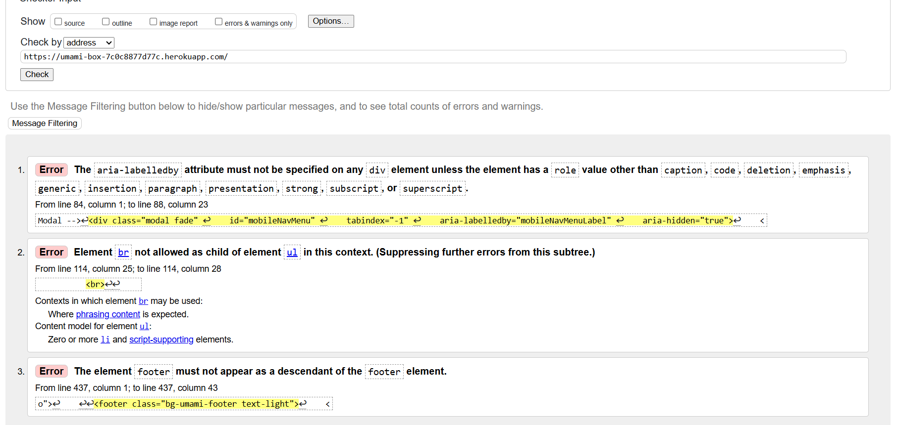
Home HTML was fine. No errors occurred during validation; however, there are a few base.html and nav-bar.html errors, and the corrections are below.
1. Revise code for nav-bar.html : 
```
<div class="modal fade"
    id="mobileNavMenu"
    tabindex="-1"
    aria-labelledby="mobileNavMenuLabel"
    aria-hidden="true"
    role="dialog">
```

2. Revise code for footer section in base.html : 
```
<div class="mt-auto">
    
</div>
```

3. Removed <br> for mobile nav-bar


**Shop**
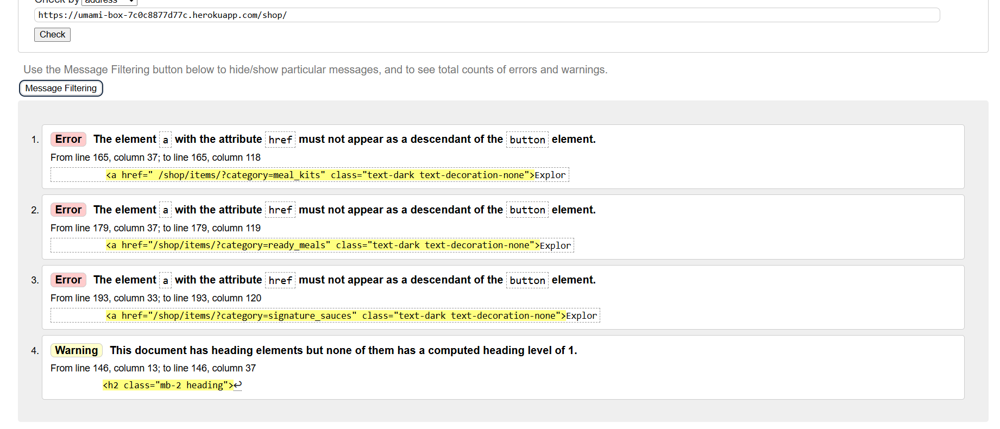
1. Remove <button> and use a href instead: 
```
Original code:
<button class="btn btn-outline-dark">
    <a href="?category=meal_kits" class="text-dark text-decoration-none">
        Explore Meal Kits
    </a>
</button>

Revised Fixes: 
<a href="?category=meal_kits" class="btn btn-light px-4 py-2 mt-1">
Explore More
</a>
```

**Product detail**
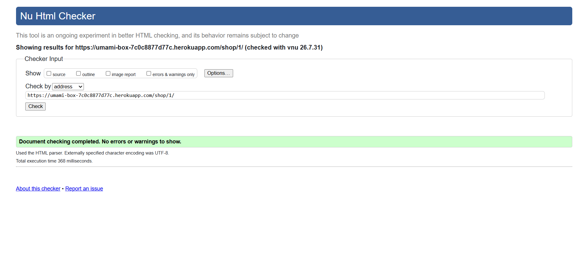
No issues detected

**Basket**
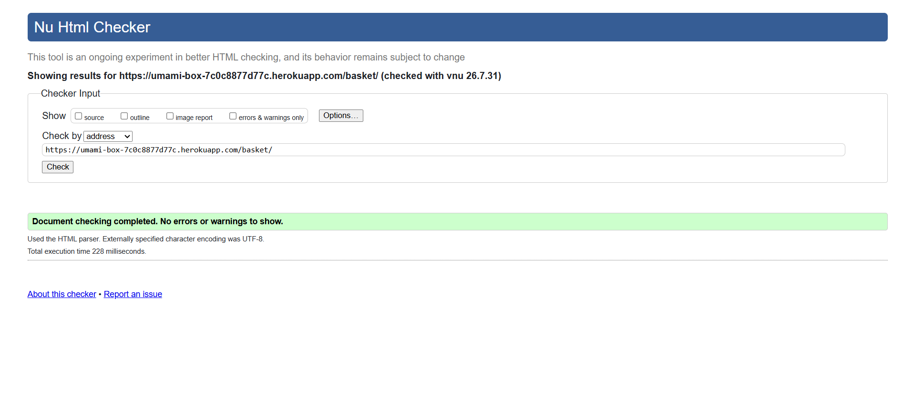
No issues detected

**Checkout**
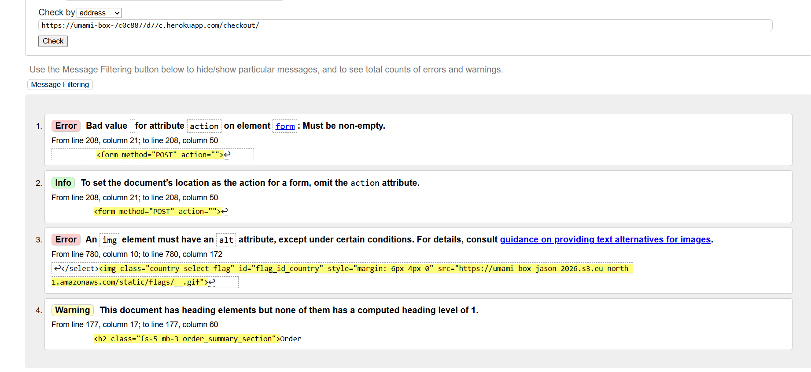

1. Update checkout html
   ```
   Original code :
   <form method="POST" action="">↩

   Revised fixes:
   <form method="POST" >
   ```
   
2. Remove CountrySelectWidget in forms.py
   ```
   Original code :
   'country': CountrySelectWidget(attrs={
    'class': 'profile-form-input',
   }),

   Revised fixes:
   'country': forms.Select(attrs={
    'class': 'profile-form-input',
   ```

**Login**
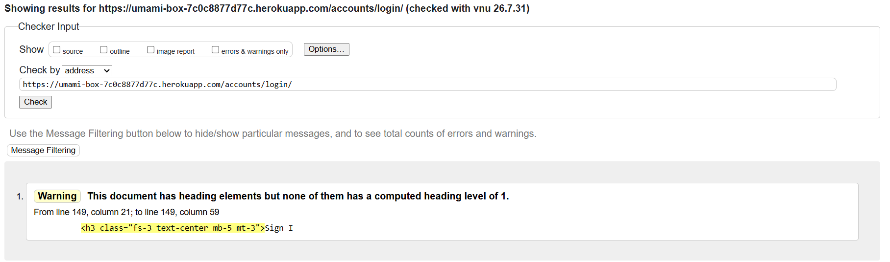
No errors detected, only minor warning issues that have been ignored.

**Signup**
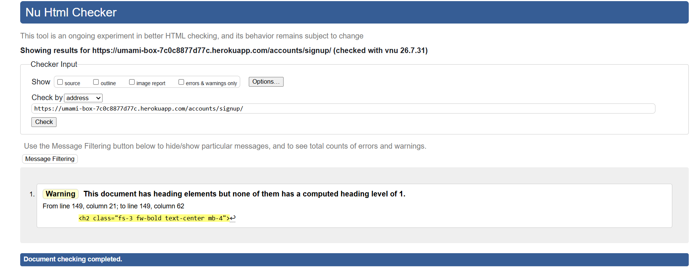
No errors detected, only minor warning issues that have been ignored.

**Profile**

No issues detected

**How It Works**
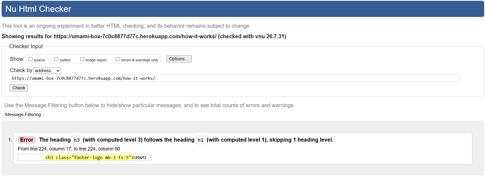
No issues detected for how-it-works.html; however, there is a footer issue which has been resolved.
```
Original code:
<h3 class="footer-logo mb-3 fs-5">UMAMI BOX</h3>

Revised fix:
<p class="footer-logo mb-3 fs-5">UMAMI BOX</p>
```

**Sustainability**
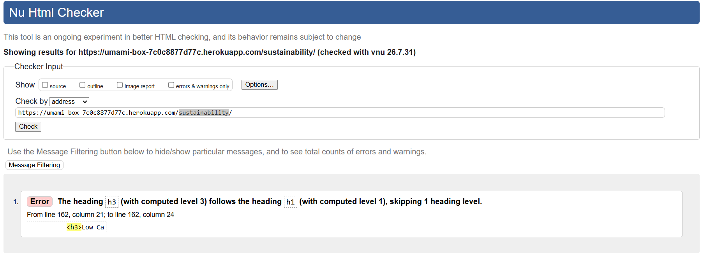
Correct heading size

```
Original code:
<h3>Reusable Ice Packs</h3>

Revised fix:
<h2 class="fs-5">Reusable Ice Packs</h2>
```

**About**
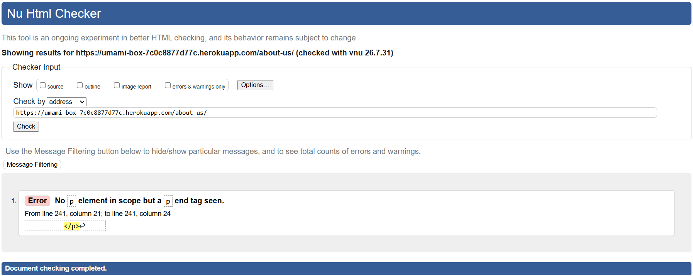
Remove additional "p" end tag


#### 4.04 Testing with CSS Validator
##### base.css
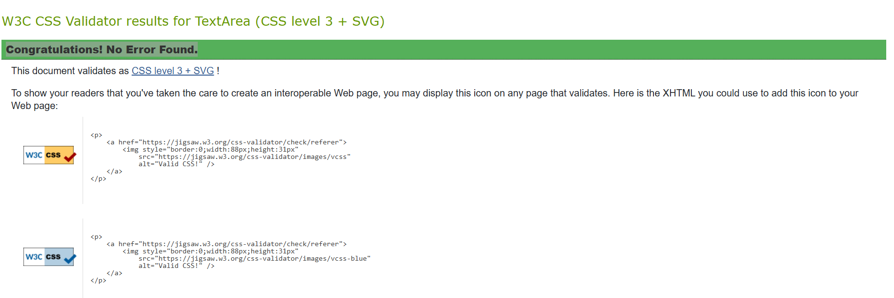
No errors found

##### shop.css
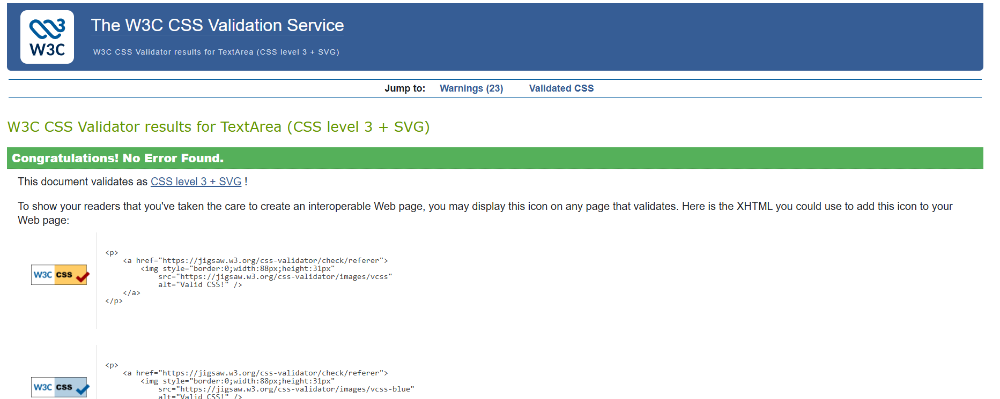
No errors found

##### basket.css

No errors found

##### checkout.css
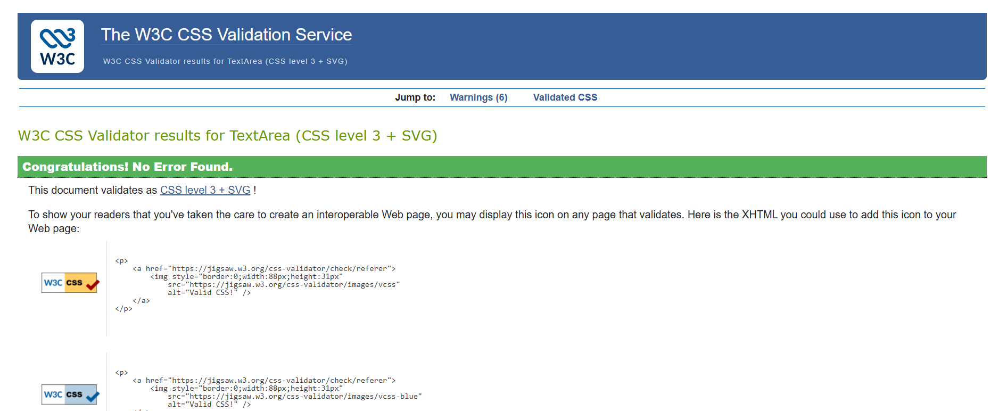
No errors found

##### profiles.css
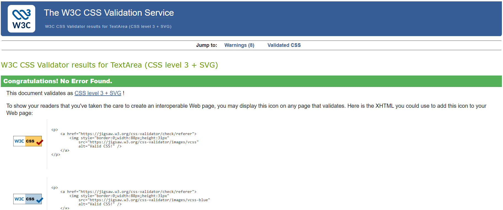
No errors found

##### account.css
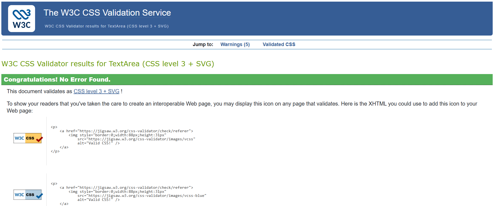
No errors found

#### 4.05 Testing with Lighthouse
##### Home
| Performance | Accessibility | Best Practices | SEO |
| --- | --- | --- | --- |
| 74 | 96 | 96 | 91 |

The website has heavily loaded images, resulting in delays and slightly poor performance.
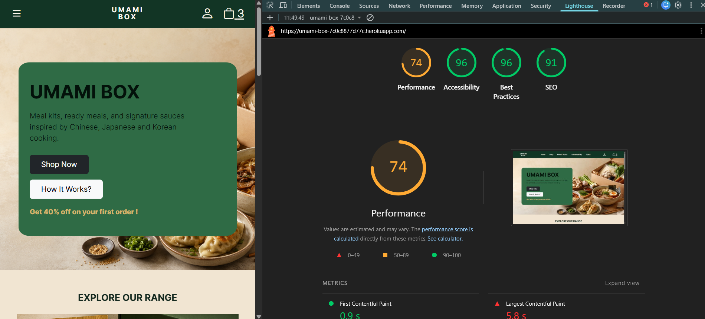
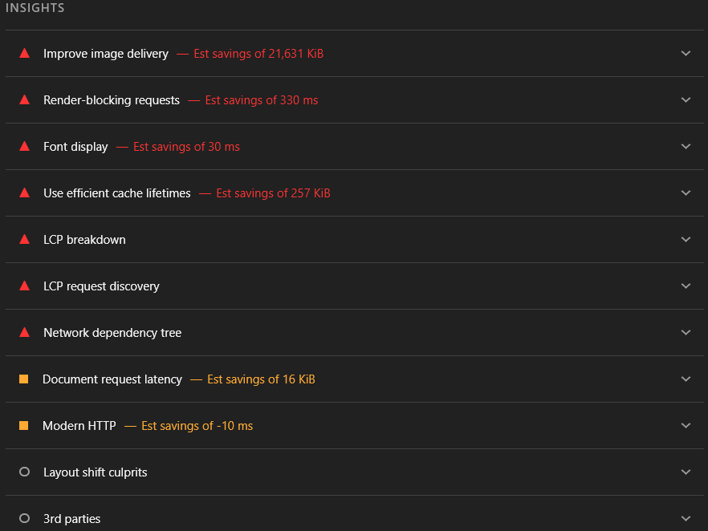


##### Shop
| Performance | Accessibility | Best Practices | SEO |
| --- | --- | --- | --- |
| 56 | 100 | 96 | 91 |
The shop page scored lower for performance due to multiple product images.
Accessibility, best practices and SEO scores were strong. Future improvements would include finding an alternative method for image compression, such as WebP image formats.

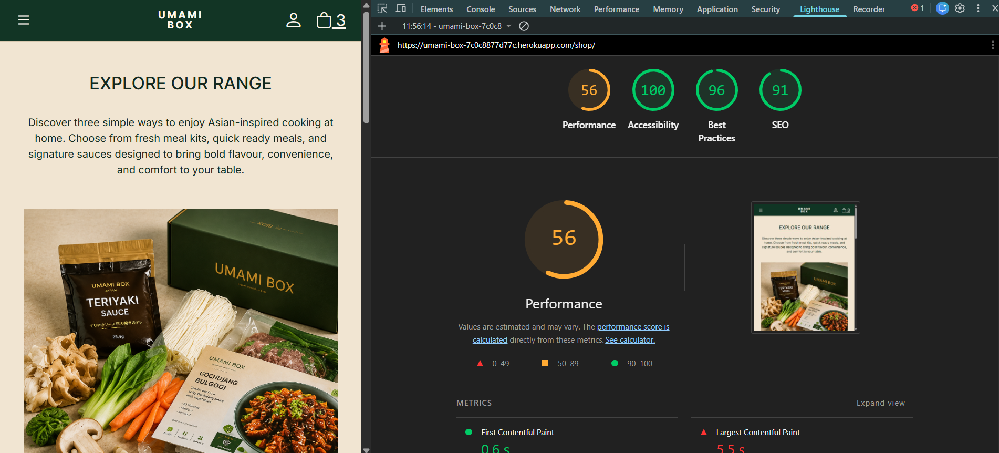
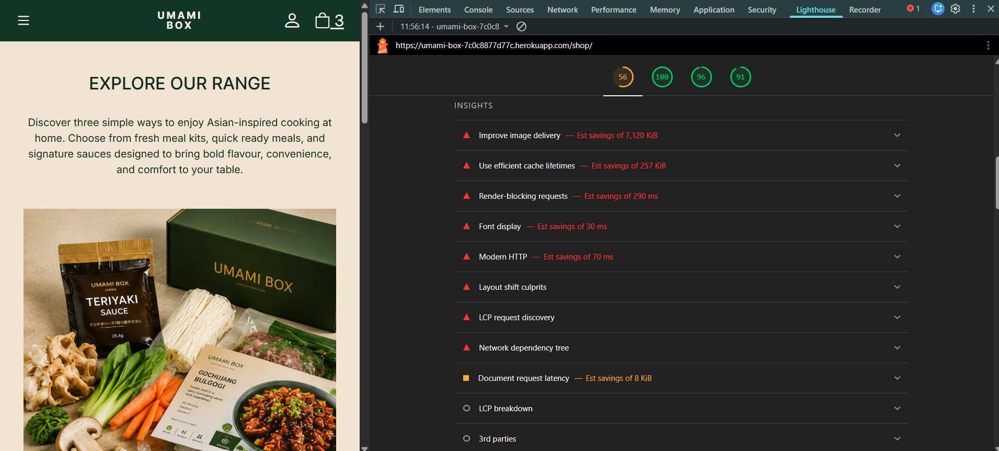

##### Product detail
| Performance | Accessibility | Best Practices | SEO |
| --- | --- | --- | --- |
| 81 | 100 | 96 | 91 |

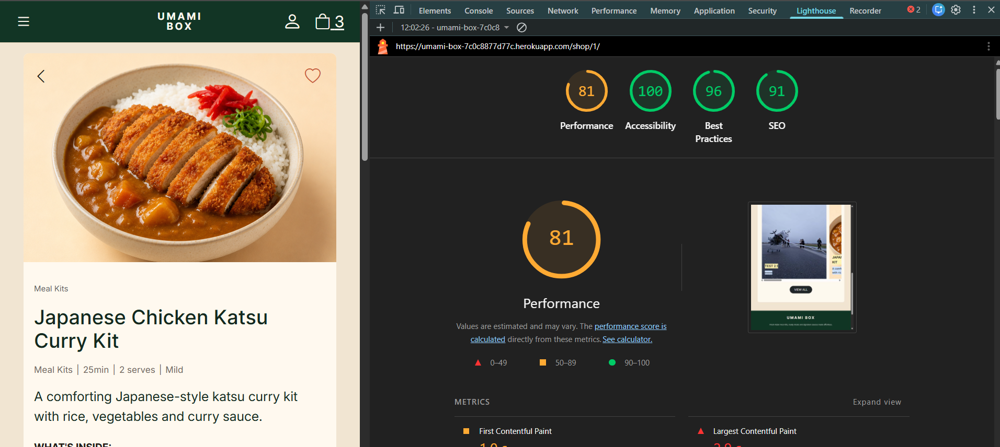
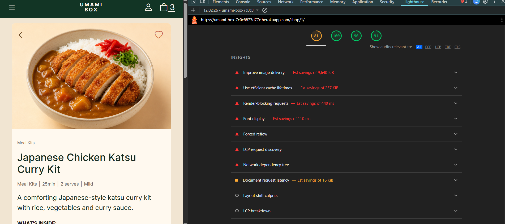

##### Basket
| Performance | Accessibility | Best Practices | SEO |
| --- | --- | --- | --- |
| 74 | 96 | 96 | 91 |

##### Checkout
| Performance | Accessibility | Best Practices | SEO |
| --- | --- | --- | --- |
| 74 | 96 | 96 | 91 |

##### Profile
| Performance | Accessibility | Best Practices | SEO |
| --- | --- | --- | --- |
| 74 | 96 | 96 | 91 |

---

### 5.00 Deployment
#### 5.01 Deployment Progress Completed

#### 5.02 How to run this project locally

---

### 6.00 Security

---

### 7.00 Credit
#### 7.01 Content
#### 7.02 Media
#### 7.03 Code
#### 7.04 Acknowledgements
Thank you to the Code Institute tutors for guidance throughout the project development process.
